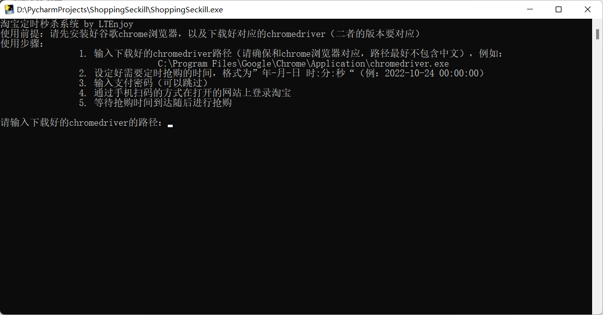

# ShoppingSeckill

PC端网上购物秒杀助手

最新编辑日期：2022/10/24

有疑问推荐在Issues上提出以供他人参考。

个人邮箱：[sujinltenjoy@gmail.com](mailto:sujinltenjoy@gmail.com)。

如果有帮到您的话，麻烦顺手点个star~

## 更新日志

2022/10/24	完成淘宝网站的购物秒杀。

## 前言

之前在github上找到了一个淘宝秒杀助手的仓库[jerry3747/taobao_seckill](https://github.com/jerry3747/taobao_seckill)，由于年久失修，已经无法正常使用。所以我把仓库扒下来进行了更新，并包装成命令行界面发布出来供大家使用。

## 原理

该程序通过python的selenium库模拟浏览器操作，通过定时清空购物车里的商品并完成支付，达到秒杀的目的。

## 支持网站

目前仅支持淘宝网的购物秒杀辅助。后续随缘更新其他购物网站的秒杀辅助。

## 文件说明

**main.py**是主程序的python文件，支持python环境下运行。

**ShoppingSeckill.exe**是打包好的可执行文件，可以直接下载运行。

其他文件则是程序运行的子文件，内部实现简单，读者可自行查看。

## 使用说明

下载可执行文件ShoppingSeckill.exe，打开后按照说明操作即可。界面如下图所示：

## 注意事项

搬运自原仓库：

淘宝有针对selenium的检测，如果遇到验证码说明被反爬了，遇到这种情况应该换一个方案，凡是用到selenium都会严重依赖网速、电脑配置。

如果想直接绕过淘宝的检测，可以手动打开浏览器登陆淘宝，然后再用selenium接管浏览器。只提供思路，具体实现大佬们可以自己摸索。

